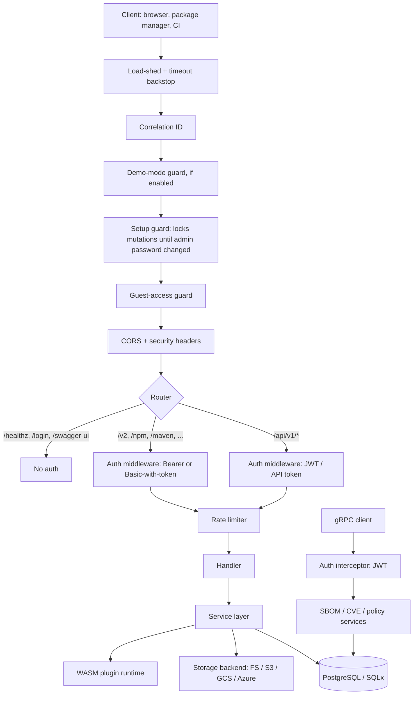

# Architecture

This document describes how the Artifact Keeper backend is put together, for
people who maintain it. It covers the request path, where code lives, the
OpenAPI and SDK pipeline, the storage and database layers, the WASM plugin
runtime, and the invariants that must not be broken. It is not an end-user
guide; for deployment and format usage see the documentation site.

The backend is a single Rust crate (`artifact-keeper-backend`, binary
`artifact-keeper`) built on Axum, SQLx, and Wasmtime. It serves an HTTP API on
port 8080 and a gRPC API on port 9090, backed by PostgreSQL and a pluggable
object store.

## Request flow

Every HTTP request passes through a layered middleware pipeline before it
reaches a handler. Handlers hold no business logic of consequence; they parse
and validate input, call one or more services, and shape the response. Services
own the business rules and are the only layer that talks to the database and the
storage backends.



The middleware is assembled in `api/routes.rs`. Because Axum applies layers from
the outside in, the code adds them in reverse: the last `.layer(...)` call is the
outermost. The effective order a request sees is:

| Order | Layer | Purpose |
|-------|-------|---------|
| 1 | Backstop | Optional global concurrency load-shed and request timeout, returning 503 so clients back off. Disabled by sentinel config values. |
| 2 | Correlation ID | Extracts or generates a request correlation ID and records it on the tracing span. |
| 3 | Demo guard | Blocks mutating verbs when `DEMO_MODE` is on. |
| 4 | Setup guard | Blocks API mutations until the default admin password has been changed on first boot. |
| 5 | Guest-access guard | When guest access is disabled, requires authentication for everything except a small allowlist (login, setup, health, OCI challenge). |
| 6 | CORS + security headers | Same-origin in production, explicit allowlist plus private-network origins in development. |
| 7 | Auth | Per-route. Resolves a principal into an `AuthExtension` request extension. See below. |
| 8 | Rate limiter | Per-IP and per-principal buckets, plus a stricter login limiter. Keys on the real TCP peer via `ConnectInfo<SocketAddr>`. |

Authentication is applied per route group rather than globally, because the two
API surfaces have different rules (documented in `api/openapi.rs`):

- The JSON management API under `/api/v1/*` accepts API tokens and login-issued
  JWTs only as `Authorization: Bearer <token>`. HTTP Basic on `/api/v1/*` is
  validated only as a real `username:password` login; the password half is never
  retried as an API token.
- Format (package-manager) endpoints such as `/v2/*` (OCI), `/npm`, `/maven`,
  `/debian`, and the language registries also accept HTTP Basic with the API
  token in the password field (any username), matching the `pip` netrc and
  Artifactory-style conventions that package managers expect.

Supported credential carriers are JWT (login flow, OIDC, SAML), LDAP bind, API
keys (`Authorization: Bearer`, `Authorization: ApiKey`, `X-API-Key`, and
`X-NuGet-ApiKey` on the NuGet push route only), single-use download tickets, and
service-account tokens. The resolved principal lands in `AuthExtension`, whose
`Default` fails closed (anonymous, non-admin, empty repo scope).

gRPC has its own pipeline. `grpc/auth_interceptor.rs` validates JWT Bearer
tokens on every RPC and consults the credential-change watermark in Postgres so a
password reset on one replica invalidates tokens cluster-wide. Server reflection
is off unless `GRPC_REFLECTION_ENABLED` is set.

Startup lives in `main.rs::run_server`. It installs the rustls crypto provider,
loads config, connects the pool, runs migration repair and then migrations,
provisions the first admin, bootstraps SSO from env vars, initializes storage,
scanners, search, plugins, and background workers, and finally binds the HTTP and
gRPC listeners. Shutdown is driven by a single `CancellationToken` shared by the
servers and every background task, triggered by Ctrl+C or SIGTERM.

## Directory map

```
backend/src/
  main.rs              Startup, shutdown, background-worker wiring
  config.rs            Env-var configuration (Config::from_env)
  db.rs                PgPool creation with idle-connection liveness probes
  error.rs             AppError and the crate-wide Result alias
  api/
    routes.rs          Router assembly and middleware layering
    openapi.rs         Root OpenAPI doc + build_openapi() module merge
    middleware/        auth, rate_limit, demo, setup, guest_access, tracing,
                       security_headers, metrics
    handlers/          ~90 handler modules, one per format + core feature
    validation.rs      Shared input validation, SSRF guards
    extractors.rs      Custom Axum extractors
  formats/             ~40 native package-format implementations
  services/            ~107 business-logic services (the only DB/storage callers)
  storage/             StorageBackend trait + FS/S3/GCS/Azure backends, registry
  grpc/                Tonic services, auth interceptor, generated protobuf
  models/              Domain types and DTOs
  wit/                 WIT contract for WASM plugins (format-plugin.wit)
  migrations/          Numbered SQL migrations (append-only)
  .sqlx/               Offline SQLx query cache (committed)
```

Where to add things:

- **A new format handler.** Add the wire-protocol implementation under
  `formats/`, add its HTTP handler module under `api/handlers/`, nest its router
  in the `format_routes` block in `api/routes.rs`, and follow the API-change
  steps below so the endpoints reach the SDKs. Update the documentation surfaces
  listed in the workspace `CLAUDE.md`.
- **A new endpoint on an existing feature.** Add the handler function with a
  `#[utoipa::path(...)]` annotation, add `#[derive(ToSchema)]` to its
  request/response types, register the path in that module's `XxxApiDoc` struct,
  and wire the route into the relevant router in `api/routes.rs`.
- **A new service.** Add a module under `services/`, expose it from
  `services/mod.rs`, and construct it in `main.rs::run_server`, storing it on
  `AppState` with a setter if handlers need it.

## OpenAPI and SDK pipeline

The OpenAPI spec is generated from the code, not hand-written. Each handler
module owns a `#[derive(OpenApi)]` struct (for example
`handlers::npm::NpmApiDoc`) that lists its annotated paths. `api/openapi.rs`
holds the root `ApiDoc` with the shared info block, security schemes, and tags,
and `build_openapi()` merges every module doc into it from a single named list.

```
utoipa #[utoipa::path] + ToSchema
  -> per-module XxxApiDoc
  -> build_openapi() merges all modules into the root ApiDoc
  -> served at /api/v1/openapi.json and /swagger-ui
  -> exported to openapi.json in CI on release tags
  -> pushed to the artifact-keeper-api repo
  -> five SDK generators (TypeScript, Kotlin, Swift, Rust, Python)
  -> consumed by web, iOS, and Android
```

To add or change an endpoint: annotate the handler, derive `ToSchema` on its
types, register the path in the module's `XxxApiDoc`, and if the module is new
add one line to the merge list in `build_openapi()`. Verify locally with
`cargo test --lib test_openapi_spec_is_valid`. Forgetting the merge line is the
usual failure: the endpoint works at runtime but never appears in the spec or the
SDKs, and the spec-count test (below) catches a dropped module.

## Storage abstraction

Storage is a content-addressable object store behind the `StorageBackend` trait
in `storage/mod.rs`. Keys are derived from the SHA-256 of the content, so
identical bytes are stored once. Four backends implement the trait: filesystem,
S3, GCS, and Azure Blob. The primary backend is chosen by `STORAGE_BACKEND`; a
`StorageRegistry` holds every backend that has credentials available and routes
per-repository so a single instance can span backends.

The trait requires `put_stream`, which computes the SHA-256 incrementally as
bytes arrive. It has no default body on purpose: a new backend cannot silently
inherit whole-body buffering, which is the multi-gigabyte OOM hazard the
streaming work removed. `get_stream`, `get_range`, `put_file`, and `copy` have
memory-bounded default implementations that build on the streaming primitives,
so a backend gets them for free. Test doubles that genuinely want buffering call
the named `buffered_put_stream_fallback` helper explicitly.

Downloads can be offloaded to the object store. A backend reports
`supports_redirect()`, and `get_presigned_url()` returns a time-limited
`PresignedUrl` (S3 or CloudFront, GCS signed URL, or Azure SAS). When both the
backend and the deployment allow it, the download handler returns a redirect to
that URL instead of streaming bytes through the process. Filesystem returns
`None` from both and always streams.

Storage paths shard by checksum prefix. `STORAGE_PATH_FORMAT` selects the layout
in `storage/path_format.rs`:

| Mode | Layout | Use |
|------|--------|-----|
| `native` (default) | `ab/cd/abcd...` (two-level) | New deployments. |
| `artifactory` | `ab/abcd...` (one-level) | Reusing existing Artifactory object data. |
| `migration` | Write native, read both | Zero-downtime migration off Artifactory. |

## Database

PostgreSQL is the system of record. Queries go through SQLx in offline mode
(`SQLX_OFFLINE=true`): the macros type-check against the cached query metadata in
`.sqlx/` at the repo root rather than a live database, so unit tests and CI builds
need no Postgres. When you add or change a `query!`/`query_as!` invocation,
regenerate the cache with `cargo sqlx prepare` against a migrated database and
commit the changed `.sqlx/` files. A build that fails with a missing-query error
is almost always a stale cache.

Migrations live in `backend/migrations/` as numbered SQL files
(`001_users.sql`, `002_roles.sql`, and so on) and are embedded with
`sqlx::migrate!`. They run automatically at startup on a dedicated connection
with raised statement and lock timeouts, unless `SKIP_MIGRATIONS=true`. The
discipline is strict:

- **Append only.** Never edit or renumber a migration that has shipped. SQLx
  records a checksum per migration; changing an applied file makes the runner
  refuse to start with a version mismatch. Fix forward with a new migration.
- **Monotonic numbering.** New migrations take the next unused number. Out-of-
  order numbers break the ordering the runner and the `.sqlx` cache assume.
- **Backfills are additive.** Data backfills (for example the OCI ref and blob-ref
  backfills) run in the background at startup and only ever add rows. Destructive
  operations gate behind readiness checks so a half-finished backfill cannot lead
  to deletion.

`main.rs` runs a set of one-shot repair routines before the migration gate to
reconcile ledgers from older releases; they no-op on healthy databases.

## WASM plugin runtime

Custom format handlers can ship as WASM plugins instead of native Rust. The
contract is the WIT interface in `wit/format-plugin.wit`. A plugin exports a
`handler` interface (`format-key`, `parse-metadata`, `validate`,
`generate-index`) and optionally a `request-handler` interface that serves a
format's native client protocol directly from WASM. Each plugin ships a
`plugin.toml` manifest declaring its format key, file extensions, capabilities,
and resource limits.

Plugins run under Wasmtime (`services/wasm_runtime.rs`) inside a sandbox with
dual-layer resource protection: fuel metering caps CPU work and a wall-clock
timeout caps latency, with a per-store memory ceiling from
`StoreLimitsBuilder`. The WASI context is minimal (inherited stdio only); plugins
get no ambient filesystem or network access. Limits come from the manifest's
`[resources]` block (memory bytes, fuel, execution milliseconds).

The trust model is fail-closed and enforced in `services/wasm_plugin_service.rs`.
When `PLUGINS_REQUIRE_SIGNED` is set, a plugin is rejected unless a trusted
Ed25519 public key is configured, a detached `<plugin>.wasm.sig` signature
accompanies the WASM, and that signature verifies against the trusted key.
Missing key, missing signature, or a verification failure all reject the install
or reload. The signature policy gates the install and reload ingress paths;
plugins already recorded as trusted in the database are loaded at startup without
re-gating.

## Invariants a maintainer must not break

These are enforced by tests or by the toolchain. Breaking one usually shows up as
a failing build rather than a runtime surprise, which is the point.

- **OpenAPI spec thresholds.** `test_openapi_spec_is_valid` in `api/openapi.rs`
  asserts at least 200 paths, 200 schemas, and 250 operations, and that both
  security schemes are present. A dropped module merge or a stripped annotation
  trips it. Raise the floors as the surface grows; do not lower them to make a
  removal pass.
- **Streaming on artifact paths.** A clippy `disallowed-methods` gate
  (`.clippy.toml`) forbids `reqwest::Response::bytes`,
  `Multipart::Field::bytes`, and `axum::body::to_bytes` on artifact paths,
  because each buffers a whole body in memory. Existing exempt sites carry a
  `STREAMING-EXEMPT` annotation and are enumerated in
  `tests/streaming_invariant.rs`. New artifact code must stream.
- **`put_stream` has no default.** Do not give `StorageBackend::put_stream` a
  default body. Its absence is what forces every backend to choose real streaming
  or the explicit buffered fallback.
- **Migration ordering and immutability.** Numbered, append-only, never edited
  after shipping. See the database section.
- **`.sqlx` cache is committed and current.** Offline builds depend on it.
  Regenerate and commit it whenever queries change.
- **Format wire-protocol compatibility.** Format handlers implement real
  package-manager protocols that external clients depend on. Changing response
  shapes, paths, or headers can break `pip`, `cargo`, `docker`, and the rest.
  Treat these as public contracts and cover changes with the native-client
  tests under `scripts/native-tests/`.
- **Auth surface asymmetry.** Keep the `/api/v1/*` versus format-endpoint auth
  rules intact: Basic-with-token is accepted on format endpoints only, never on
  `/api/v1/*`.
- **Fail-closed defaults.** `AuthExtension::default` and the plugin signature
  gate deny by default. Preserve that when refactoring.
- **MSRV 1.75.0.** Set in `.clippy.toml`. Do not use language or standard-library
  features newer than 1.75 without raising the MSRV deliberately.
</content>
</invoke>
